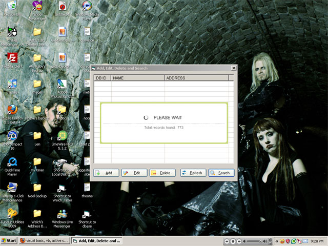



## A simple Add, Edit, Delete, Search in Database \(MS Access\)

### Description

This is a very simple program using VB and MSAccess. This code will allow you to Add, Edit, Delete, and Search entries in the database. NOTE: THIS PROGRAM USES OCX AND PLANETSOURCECODE DOES NOT ALLOW SUBMISSIONS WITH OCX IN IT. YOU MUST DOWNLOAD FIRST THE OCX FILE @ www.giftedkid.org/welch THEN INSTALL IT BEFORE YOU RUN THIS PROGRAM.
 
### More Info
 

             |
---                |---
**Submitted On**   |2009-06-22 21:28:10
**By**             |[Welch Marcellana](https://github.com/Planet-Source-Code/PSCIndex/blob/master/ByAuthor/welch-marcellana.md)
**Level**          |Beginner
**User Rating**    |4.6 (37 globes from 8 users)
**Compatibility**  |VB 6\.0
**Category**       |[Databases/ Data Access/ DAO/ ADO](https://github.com/Planet-Source-Code/PSCIndex/blob/master/ByCategory/databases-data-access-dao-ado__1-6.md)
**World**          |[Visual Basic](https://github.com/Planet-Source-Code/PSCIndex/blob/master/ByWorld/visual-basic.md)
**Archive File**   |[A\_simple\_A2155566222009\.zip](https://github.com/Planet-Source-Code/welch-marcellana-a-simple-add-edit-delete-search-in-database-ms-access__1-72197/archive/master.zip)

